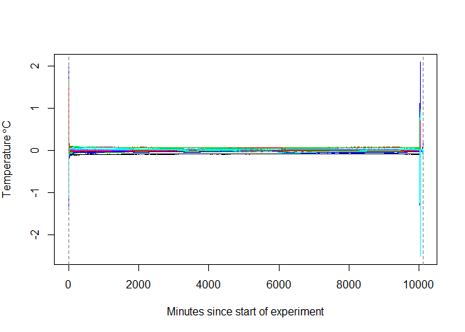
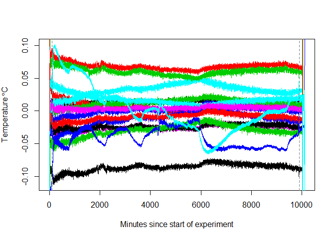

[](https://travis-ci.org/Faskally/loggercal)

Temperature Logger Calibration
==============================

The first step is to load the loggercal package

``` r
devtools::install_github("faskally/loggercal")
library(loggercal)
```

The first thing to do is to set the location of the external and internal calibrations we are looking to compare.

``` r
externalCalDir <- "data-raw/External Calibrations/"
internalCalDir <- "data-raw/100214/"
```

External calibration data
-------------------------

Next we look for the external calibration files from a UKAS calibration. These should all be in one directory. In this case we find two external calibrations. These are read in using the `loggercal` function `readExternalCal`

``` r
ukas <- readExternalCal(externalCalDir)
```

    ## Calibration file summary
    ## 
    ##   Current working directory:
    ##  D:/projects/faskally/loggercal
    ##   Files read:
    ##  data-raw/External Calibrations/UKASCalibration_319151.csv
    ##  data-raw/External Calibrations/UKASCalibration_613892.csv

``` r
str(ukas)
```

    ## List of 2
    ##  $ SN  : chr [1:2] "319151" "613892"
    ##  $ data:List of 2
    ##   ..$ 319151:'data.frame':   8 obs. of  5 variables:
    ##   .. ..$ control    : num [1:8] 19.996 25.013 29.993 5.025 -0.002 ...
    ##   .. ..$ cal        : num [1:8] 19.946 24.975 29.954 4.929 -0.118 ...
    ##   .. ..$ Error      : num [1:8] -0.05 -0.038 -0.039 -0.096 -0.116 -0.081 -0.062 -0.051
    ##   .. ..$ Time       : chr [1:8] " 00:30:00" " 00:30:00" " 00:30:00" " 00:30:00" ...
    ##   .. ..$ Uncertainty: num [1:8] 0.025 0.025 0.025 0.025 0.025 0.025 0.025 0.025
    ##   ..$ 613892:'data.frame':   8 obs. of  5 variables:
    ##   .. ..$ control    : num [1:8] 19.996 25.013 29.993 5.025 -0.002 ...
    ##   .. ..$ cal        : num [1:8] 19.946 24.975 29.954 4.929 -0.118 ...
    ##   .. ..$ Error      : num [1:8] -0.05 -0.038 -0.039 -0.096 -0.116 -0.081 -0.062 -0.051
    ##   .. ..$ Time       : chr [1:8] " 00:30:00" " 00:30:00" " 00:30:00" " 00:30:00" ...
    ##   .. ..$ Uncertainty: num [1:8] 0.025 0.025 0.025 0.025 0.025 0.025 0.025 0.025
    ##  - attr(*, "class")= chr "ExternalCal"

we now fit a model to the external calibration data

``` r
externalCalMod <- lapply(ukas $ data, function(x) lm(cal ~ poly(control, 2), data = x[-1,]))
```

Read in internal calibration data
---------------------------------

``` r
internalCal <- readInternalCal(internalCalDir)
```

    ## Reading calibration experiment
    ## 
    ##   Current working directory:
    ##  D:/projects/faskally/loggercal
    ##   Files:
    ##  data-raw/100214//FullCalibration_100214.csv

``` r
internalCal
```

    ## 
    ## Internal calibration experiment:
    ##        SN                   Type Description    Property
    ## 1  640248                TG-4100     Tinytag Temperature
    ## 2  642016                TG-4100     Tinytag Temperature
    ## 3  642027                TG-4100     Tinytag Temperature
    ## 4  642031                TG-4100     Tinytag Temperature
    ## 5  642042                TG-4100     Tinytag Temperature
    ## 6  642269                TG-4100     Tinytag Temperature
    ## 7  642284                TG-4100     Tinytag Temperature
    ## 8  642302                TG-4100     Tinytag Temperature
    ## 9  642303                TG-4100     Tinytag Temperature
    ## 10 642315                TG-4100     Tinytag Temperature
    ## 11 642326                TG-4100     Tinytag Temperature
    ## 12 642337                TG-4100     Tinytag Temperature
    ## 13 642362                TG-4100     Tinytag Temperature
    ## 14 642387                TG-4100     Tinytag Temperature
    ## 15 643055                TG-4100     Tinytag Temperature
    ## 16 319151 Tinytag PLUS2 -40/85°C     Tinytag Temperature
    ## 17 613892               TGP-4017     Tinytag Temperature

Now it should be checked that the external calibration loggers were included in the experiment

``` r
ukas
```

    ## 
    ## External calibration serial numbers:
    ## [1] "319151" "613892"

And here, the last two loggers in the internal calibration are the externally calibrated ones. The next step is to define the start and stop of the calibration. This can be done manually (note that the value `startStopSec` is in seconds, while the plot axis is in minutes, so you need to multiply by 60 to set limits in secs):

``` r
plot(internalCal)
```



``` r
internalCal$startStopSec <- c(100,9900) * 60
plot(internalCal)
```



Or this can be done using a graphical approach, in a handy function.

``` r
internalCal <- findStartSec(internalCal)
internalCal <- findStopSec(internalCal)
plot(internalCal)
```

run the calibration
-------------------

The function `calibration` runs the full calibration method. Here, as we are running an example, we only use 5 simulations to back calculate the logger error. Normally a large number like 99 or 999 should be used, but this can take up to a day to run.

``` r
cal <- calibration(internalCal, externalCalMod, n = 5)
```

    ## Setting up calibration regressions.

    ## multiple caliibration loggers found in experiment. Only the first used.

    ## fitting 640248: 1 of 15
    ## fitting 642016: 2 of 15
    ## fitting 642027: 3 of 15
    ## fitting 642031: 4 of 15
    ## fitting 642042: 5 of 15
    ## fitting 642269: 6 of 15
    ## fitting 642284: 7 of 15
    ## fitting 642302: 8 of 15
    ## fitting 642303: 9 of 15
    ## fitting 642315: 10 of 15
    ## fitting 642326: 11 of 15
    ## fitting 642337: 12 of 15
    ## fitting 642362: 13 of 15
    ## fitting 642387: 14 of 15
    ## fitting 643055: 15 of 15

Once the calibration simulations have completed, the coefficients from the calibrations are extracted and tabled (e.g. for import into a logger database with calibration functionality).

``` r
coefs <- getCoefs(cal)
tabCoefs <- tableCoefs(coefs, cal = internalCal)
tabCoefs
```

    ##       Make   Model     SN Unit Start_date Cal_Eq_type         Cal_coef1
    ## 1  Tinytag TG-4100 640248   °C 2014-02-10           2 0.252032182779831
    ## 2  Tinytag TG-4100 642016   °C 2014-02-10           2  0.26451422390536
    ## 3  Tinytag TG-4100 642027   °C 2014-02-10           2 0.242310951688825
    ## 4  Tinytag TG-4100 642031   °C 2014-02-10           2  0.22622377356779
    ## 5  Tinytag TG-4100 642042   °C 2014-02-10           2 0.251740169803926
    ## 6  Tinytag TG-4100 642269   °C 2014-02-10           2 0.210189942410341
    ## 7  Tinytag TG-4100 642284   °C 2014-02-10           2 0.137413429477419
    ## 8  Tinytag TG-4100 642302   °C 2014-02-10           2 0.324037655605613
    ## 9  Tinytag TG-4100 642303   °C 2014-02-10           2 0.313455534160002
    ## 10 Tinytag TG-4100 642315   °C 2014-02-10           2 0.197860755901601
    ## 11 Tinytag TG-4100 642326   °C 2014-02-10           2 0.282905288351137
    ## 12 Tinytag TG-4100 642337   °C 2014-02-10           2 0.245713687427616
    ## 13 Tinytag TG-4100 642362   °C 2014-02-10           2 0.212107512950752
    ## 14 Tinytag TG-4100 642387   °C 2014-02-10           2 0.221025413326905
    ## 15 Tinytag TG-4100 643055   °C 2014-02-10           2 0.184852149284697
    ##            Cal_coef2            Cal_coef3 Cal_coef4 Cal_coef5 Cal_coef6
    ## 1  0.989245489925417 0.000173340177358574                              
    ## 2  0.988384128953682 0.000161436868978696                              
    ## 3  0.989527233632773 0.000183488092756772                              
    ## 4  0.990484396477442 0.000151112767711866                              
    ## 5     0.990035744737 0.000189484696527568                              
    ## 6  0.989763989322527 0.000156120125699476                              
    ## 7  0.990675735846172 0.000144158617054036                              
    ## 8  0.988295940245515 0.000170902604477266                              
    ## 9  0.988862052176392 0.000150244171464217                              
    ## 10 0.990977128573368 0.000165798825886908                              
    ## 11 0.987609148742668 0.000178652388012152                              
    ## 12 0.989130950659944 0.000170445271652001                              
    ## 13  0.98989830494504 0.000148457045210382                              
    ## 14 0.989846498584083 0.000167604188754604                              
    ## 15 0.990663904596241 0.000169513433329669                              
    ##    Cal_coef7 Cal_coef8 Cal_coef9 Cal_coef10 SE_Eq_type
    ## 1                                                    4
    ## 2                                                    4
    ## 3                                                    4
    ## 4                                                    4
    ## 5                                                    4
    ## 6                                                    4
    ## 7                                                    4
    ## 8                                                    4
    ## 9                                                    4
    ## 10                                                   4
    ## 11                                                   4
    ## 12                                                   4
    ## 13                                                   4
    ## 14                                                   4
    ## 15                                                   4
    ##                 SE_coef1              SE_coef2              SE_coef3
    ## 1    0.00539516052880716 -0.000496700385307514  7.26125772835808e-05
    ## 2    0.00605149094761074 -0.000352122388522784  2.71354489855285e-05
    ## 3    0.00551032044798642  0.000390714874753236 -8.33019542775592e-05
    ## 4    0.00575441407375488 -0.000230041617334428  2.47367720343503e-05
    ## 5    0.00541589717208752  0.000296019025321994 -4.94958298263848e-05
    ## 6    0.00724312721054633 -0.000744639682506059   7.8379900962142e-05
    ## 7    0.00547992142794965  0.000770444465752656 -0.000153841753433127
    ## 8  -0.000411988556984533   0.00207584698582541 -0.000231632243319076
    ## 9   0.000534468545217476   0.00213684587573535 -0.000258343826053132
    ## 10   0.00411917984115226  0.000455177012470537 -7.42324918093607e-05
    ## 11   0.00741880853334826 -0.000529836430593204  4.56919178830572e-05
    ## 12    0.0055969036432148  -0.00042707066141825   7.5036551659433e-05
    ## 13   0.00485956217891853  0.000262624772177355 -5.49538908974716e-05
    ## 14   0.00445461522450084   0.00032783626001494 -3.43276720073015e-05
    ## 15   0.00541011547964259 -1.01538971833327e-05  1.29652027120937e-05
    ##                 SE_coef4              SE_coef5 SE_coef6 SE_coef7 SE_coef8
    ## 1  -3.44983592590737e-06  5.33576961789511e-08                           
    ## 2  -4.52308739730609e-07 -3.24234319162912e-09                           
    ## 3   4.72823387536748e-06 -7.99236101955334e-08                           
    ## 4   -1.2568262070503e-06  2.42208078287144e-08                           
    ## 5   3.08161139544959e-06 -5.71467889816866e-08                           
    ## 6  -3.27208398086172e-06  4.63333853277533e-08                           
    ## 7   8.95058001033343e-06  -1.5832875580146e-07                           
    ## 8    9.6767545562711e-06 -1.33415406404143e-07                           
    ## 9   1.11656499331887e-05  -1.5758531784542e-07                           
    ## 10  4.15195717654206e-06 -7.23909620301131e-08                           
    ## 11  -1.7616014247695e-06  2.75336696983001e-08                           
    ## 12  -4.3589589977742e-06  7.93588287918256e-08                           
    ## 13  3.32641307542588e-06 -5.95611995763626e-08                           
    ## 14  1.30031281182103e-06 -1.65341187998004e-08                           
    ## 15 -1.13009092957882e-06  2.55231885727721e-08                           
    ##    SE_coef9 SE_coef10
    ## 1                    
    ## 2                    
    ## 3                    
    ## 4                    
    ## 5                    
    ## 6                    
    ## 7                    
    ## 8                    
    ## 9                    
    ## 10                   
    ## 11                   
    ## 12                   
    ## 13                   
    ## 14                   
    ## 15

A full analysis script
----------------------

``` r
library(loggercal)

externalCalDir <- "data-raw/External Calibrations/"
internalCalDir <- "data-raw/100214/"

# external calibration -------------------------

# read in external calibrations
ukas <- readExternalCal(externalCalDir)

# fit a model to the external calibration data
externalCalMod <- lapply(ukas $ data, function(x) lm(cal ~ poly(control, 2), data = x[-1,]))

# internal calibration -------------------------

# read in internal calibration experiment
internalCal <- readInternalCal(internalCalDir)

# trim off ends
internalCal$startStopSec <- c(100,9900) * 60

# plot to check
plot(internalCal)

# perform a calibration ------------

cal <- calibration(internalCal, externalCalMod, n = 5)

# convert coefficients to non orthogonal polynomials
coefs <- getCoefs(cal)
tabCoefs <- tableCoefs(coefs, cal = internalCal)

write.csv(file = file.path(file.path(internalCalDir), "coefficients.csv"), tabCoefs, row.names = FALSE)

# Done -----------------
```
